# Green_House_Watering_System

## Micro controller based environmental data logging system for greenhouse plants

**Dominik Socher**
**Feb. 2021**

This project is intended for use in a greenhouse to water plants. The system can run autonomously. This means when the plants need watering a valve opens and water the plants. This is realized with a moister sensor in the soil. Should the soil get too dry and there is no direct sunlight the valve opens. When the sensor recognizes wet soil, the valve gets shut. The system uses a basic Human-Machine-Interface to show the user relevant information about the system. It shows in which state the system is, the actual sensor variables, and the tank level. The tank gets supervised with a percolation sensor. The amount of water gets subtracted from the tank and subsequently shown on the screen in real-time. The user can run the system manually via pushbutton. Should the tank be empty the system halts and presents an error message on the screen.

## Table of contents

- [1 Introduction](#1-introduction)
- [2 System architecture](#2-system-architecture)
    - [2.1 Software](#2.1-software)
        - [2.1.1 Function HMI](#2.1.1-function-hmi)
        - [2.1.2 Function analog_map](#2.1.2-function-analog_map)
        - [2.1.3 Function analog_value](#2.1.3-function-analog_value)
        - [2.1.4 Function full_auto](#2.1.4-function-full_auto)
        -[2.1.5 Function error handler](#2.1.5-function-error-handler)
    - [2.2 Task](#2.2-task)
    - [2.3 Hardware](#2.3-hardware)
- [3 Verification](#3-verification)

## 1 Introduction

The difference between greenhouse gardening and field gardening is how much you can control watering and environmental influences. There is no rainfall inside a greenhouse which makes it possible to control the watering. An automated watering system has the advantage that it can provide the most optimal condition for the plants. Depending on light and temperature the humidity level in the soil can change drastically. Plants such as tomatoes are solanum which means they only grow at night and need watering in the dark. An automated watering system makes it possible to take those and other aspects (depending on the plants in the greenhouse) into account and can therefore increase the harvest. To do so different sensors need to be used which control for example light and temperature. I recommend a watering system which is using a sensor/actuator system based on the NIOS 32 bit soft core inside the Altera MAX_10 FPGA. The system is constantly measuring three values: temperature, the humidity of the soil, and light intensity. Those three values are measured by their corresponding sensors (each sensor will be described in the final report). As soon as the value of one of the sensors is within a predefined range, the plants will be watered. A hall sensor measures the flow rate. The amount of used water is subsequently subtracted from the water tank content. The water valve is only open for a predefined period to avoid over watering. Should the desired humidity level be reached before the end of this period (which is measured by the humidity sensor), the valve shuts. The planned watering system will include the possibility to choose between automatic and manual mode. The user can either water the plants by pressing a button or the sensor measures are used by the system to decide if watering is needed. If there is no response from the sensors or no water left in the water tank the user will receive an error message on the screen. These error messages can be reset with the reset button. The reset button also resets the water level bank to 10 liters.
The data can be presented on a VGA-Monitor to allow the user to monitor the system. Se following figure.

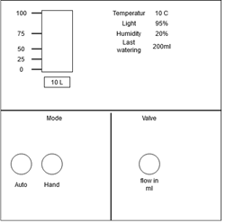  
**Figure 1 HMI**

## 2 System architecture

The greenhouse watering system is based on tasks that are scheduled by the Sierra-Real-Time-Kernel. Furthermore, the system uses the VGA driver to show a basic human-machine interface on a VGA-screen. The system logs analog data each second. Dependent on those values an output port is set high to drive a relay. There are two types of states which the system can have. The automatic mode where the system computes the data from the sensors and sets the corresponding output port high. The values are hardcoded. The hand mode where the uses can manipulate the output port via a push button. This function is mainly used for maintenance purposes.

### 2.1 Software

The software uses eight source files and two header files. The source file greenhouse_functions.h holds all the functions used trough out all the tasks. The next table gives an overview of those functions. The functions themselves will be described in the following subchapters.

Function | Description
------ | ------
extern void hmi(input parameters); | Shows basic HMI on a VGA-screen
extern alt_u32 analog_map(input parameters); | Computes raw analog data to percentage
extern alt_u32 analog_value(input parameters | This function polls the ADC
extern alt_u8 full_auto(input parameters); | This function sets the output port to the mapped analog data.
extern void error_handler(input parameters); | This function handles one error that can occur.
**Table 1 Greenhouse functions**

The header file sierra_includes.h is the main header file. In this file, all definitions for the tasks and global variables are made. Each function and variable is labeled as an extern to make this software portable. This header also includes all the system relevant headers for the sierra and Avalon hardware drivers. The following table gives a brief overview of the header content.

Function | Description
------ | ------
extern void idle_code(void); |	Idle task 
extern void hmi_code(void);	|Task handles the HMI
extern void analog_code(void);|	Task handles the analog signal processing.
extern void digital_in_code(void);|	Task handles the digital signal process.
extern void auto_code(void);|	Task handles state switching between auto and hand mode.
extern void error_code(void);|	Task handles the error states of the system.
**Table 2 Task code**

The sierra_includes.h also includes the following header files. See following table

Function | Description
------ | ------
#include "altera_avalon_sierra_ker.h" |	Sierra kernel macros
#include <altera_avalon_sierra_io.h> |	Sierra kernel macros
#include <altera_avalon_sierra_regs.h> | Sierra kernel macros
#include <altera_avalon_sierra_name.h>|	Sierra kernel macros
#include <altera_avalon_pio_regs.h>	|Macros I/O register
#include <altera_avalon_timer_regs.h>|	Hardware timer
#include <char_map.h>	|Prints character on VGA screen
#include <DE10_Lite_VGA_Driver.h>|	VGA Driver
#include <draw_vga.h>|	Prints for example circles on VGA screen
#include <stdio.h>|	Standard library for c used for printf()
#include "sys/alt_irq.h"|	Interrupt handler used for Arduino analog
#include <DE10_Lite_Arduino_Driver.h>|	Arduino Macros plus I/O headers 
**Table 3 Includes**

#### 2.1.1 Function HMI

This function is used to display all data on the VGA screen. The screen gets separated into four pieces. Every piece shows different information like the tank volume, actual sensor value, the mode in which the system is, and the error log.

##### 2.1.1.1 Function call

* Arguments: alt_u8 welcome_flag,alt_u8 mode, alt_u8 level, alt_u8 level_old, alt_u8 level_new, alt_u32 light, alt_u32 humidity
* Return type: VOID  

##### 2.1.1.2 Structure

The function depends on the welcome flag if the flag is high the function gets executed. 

1. Print frame
2. Print names and headlines
3. Print Tank figure and display global variable tank level
4. Fill the tank with nested for loop with blue color if the level equals the old level.
5. If not an empty tank with nested for loop where the iteration variable l gets incremented until the new tank level.
6. Print actual sensor values
7. Print circles for hand and auto mode
8. Fill circles rend depending on the state.

#### 2.1.2 Function analog_map

This function maps the analog value min/max to a corresponding value.

##### 2.1.2.1 Function call

* Arguments alt_u32 raw_data, alt_u32 in_min, alt_u32 in_max, alt_u32 out_min, alt_u32 out_max
* Return type alt_u32 aka long int

##### 2.1.2.2 Structure

* Calculate input parameters and return the result with the formula:

$$
(rawdata-inmin)*((outmax-outmin))/((inmax-inmin))+outmin
$$

#### 2.1.3 Function analog_value

This function reads the current analog value at the ADC.

##### 2.1.3.1 Function call

* Arguments alt_u8 channel
* Return type alt_u32 aka long int’

##### 2.1.3.2 Structure

* Cast two variables called analog in and mapped out. Both variables are long integers.
* Call ardunio_analog_read
* Input parameter => channel
* Return value => analogue in
* Map value to percent
* mapped_out = analog_map(analog_in,0,2765,0,100);
* return mapped_out

#### 2.1.4 Function full_auto

This function toggles a flag to light and humidity values. The values are predefined as light threshold and humidity threshold.

##### 2.1.4.1 Function call

* Arguments alt_u32 light alt_u32 humidity
* Return type alt_u8 aka character

##### 2.1.4.2 Structure

1. Cast output flag
2. If light under threshold and humidity above the threshold set the output to one else to 0
3. Return output

#### 2.1.5 Function error handler

This function is to handle one error. Error parameter is when the water tank is empty. It also handles the reset input. When an error occurs, the function sets the mode to manual and shuts the pump. When the reset button is pressed (if the user filled the tank) the tank gets filled to 100% and the error is acknowledged.

##### 2.1.5.1 Function call

* Arguments alt_u8 reset, alt_u8 *pump, alt_u8 *level, alt_u8 *error_flag1,alt_u8 *mode
* Return type void

##### 2.1.5.2 Structure

1. If the level is under predefined error level
2. Set error_flag to 1
3. Print error messages on screen
4. Set mode to one
5. Set pump to zero
6. If reset equals one set level to 100
7. Outer body first if level 100
8. Set error_flag to 0
9. Erase error message'

### 2.2 Task

In the under chapter, the tasks are described that are being used from the Sierra-Real-Time-Operating-System.

#### 2.2.1 Task Idle

This is a basic task with the lowest priority. It consists of a basic for loop. This task gets executed when no other task is executed

##### 2.2.1.1 Function call

* Arguments void
* Return Type void

#### #2.2.1.2 Structure

For loop, until the iteration variable, “i” is at 10000

#### 2.2.2 HMI task

This task calls the HMI() function described earlier. The task has a period time of 75. The task uses deadline control. During testing of the whole system, there were no deadline misses.

##### 2.2.2.1 Function call

* Arguments void
* Return Type void

##### 2.2.2.2 Structure

1. Call init_period_time(75)
2. Task while(1) loop Deadline control
    * Write to test with wait_for_next period
    * If test is not 0 print deadline miss
3. Task while(1) call hmi(..) function

#### 2.2.3 Analog Task

This task handles the analog input. It has a period time of 50.

##### 2.2.3.1 Function call

* Arguments void
* Return Type void

##### 2.2.3.2 Structure

Define CH0 as zero ad CH1 as one.

1. Call init_period_time(75)
2. Task while(1) loop Deadline control
    * Write to test with wait_for_next period
    * If the test is not 0 print deadline miss
3. Task while(1) take the semaphore
4. Task while(1) call function analog_value and store result in global variable light
5. Task while(1) release semaphore
6. Task while(1) take the semaphore
7. Task while(1) call function analog_value and store result in global variable humidity
8. Task while(1) release semaphore

#### 2.2.4 Digital in task

This task handles the digital input and output.

##### 2.2.4.1 Function call

* Arguments void
* Return Type void

##### 2.2.4.2 Structure

1. Call init_period_time(15)
2. Call arduino_pin_mode(6,1)
3. Task while(1) loop Deadline control
    * Write to test with wait_for_next period
    * If the test is not 0 print deadline miss
4. Task while(1) take the semaphore
5. Task while(1) call key_down_up and save the result in the key flag
6. Task while(1) release semaphore
7. Task while(1) take the semaphore
8. Task while(1) call key_down_up and save the result in key flag1
9. Task while(1) release semaphore
10. If key flag =1
    * Task while(1) take the semaphore
    * Toggle manual flag
    * Task while(1) release semaphore
11. Task while(1) take the semaphore
12. Task while(1) call key_down_up and save the result in reset flag
13. Task while(1) release semaphore
14. Write to pump port
15. Define two constants key_mask and key0_in
16. If key0in = 0 and key0in not key_flag2
    * Call clear_screen
    * Take semaphore
    * Welcome flag = 1
    * Release semaphore
17. Key_flag2 = key0_in

#### 2.2.5 Auto task

This task handles the auto and manual mode whit an if/else statement. It is the main task for this system therefore the priority is the highest and the period time is chosen with 25

##### 2.2.5.1 Function call

* Arguments void
* Return Type void

##### 2.2.5.2 Structure

1. Call init_period_time(25)
2. Task while(1) loop Deadline control
    * Write to test with wait_for_next period
    * If the test is not 0 print deadline miss
3. Call two times Arduino pin mode
4. Execute if the error flag is zero and the welcome flag is one
5. The auto mode needs the manual flag to be zero
    * Call full_auto and safe result in pump flag
    * Update level old
6. The manual mode needs the manual flag to be one
    * If the push button is pressed set the pumping flag
    * Else reset pump flag
7. Subtract water level from the tank whit help of hall effect sensor
8. Level new is tank level

#### 2.2.6 Error Task

This task handles one error case which is an empty tank. It halts the system and sets the mode to manual. It is resettable via push button 4

##### 2.2.6.1 Function call

* Arguments void
* Return Type void

##### 2.2.6.2 Structure

1. Call init_period_time(50)
2. Task while(1) loop Deadline control
    * Write to test with wait_for_next period
    * If test is not 0 print deadline miss
3. Task while(1) call error_handler() function
4. If reset_flag = 1
    * Level_new = 100
    * Level_old = 100

### 2.3 Hardware

The hardware used for this project is the DE10-Lite evaluation board by Terasic. The board contains a MAX 10 10M50DAF484C7G FPGA, 64 MB of SD-RAM, and a VGA Controller. Furthermore, an analog to digital converter is used.
The schematic shows the electrical connection for the FR4 circuit board. Page one shows the connections between the board and the sensors and page two shows the debounce circuit for the input switches.

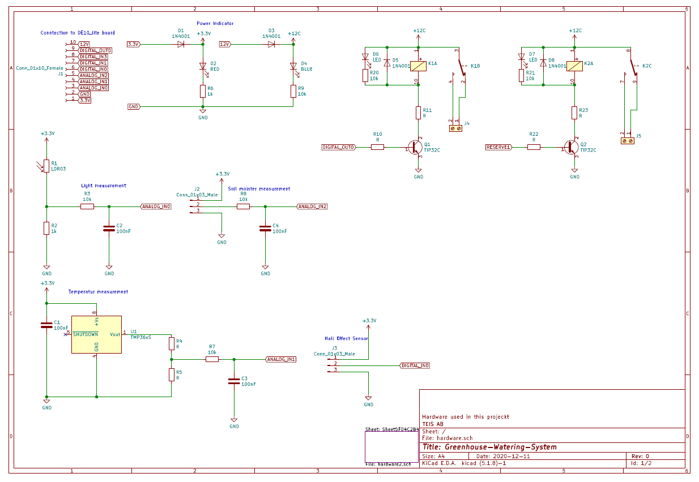  
**Figure 2 Schematic Page 1**

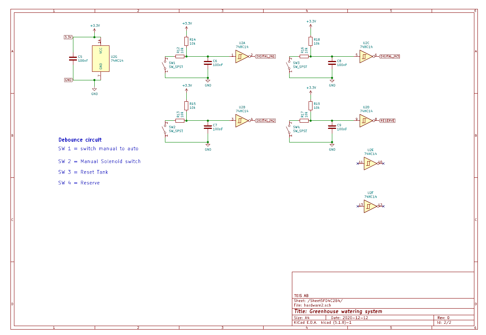  
**Figure 3 Schematic Page 2**

## 3 Verification

Task | Description | Validation
------ | ------ | ------
Switch manual to auto |	Press PB_0 to switch state |	yes
Manual water flow	| Pres PBX to open solenoid	| yes
Drive full auto |	When the system is in auto water  the plants |	yes
Error handler |	Check if the system shuts with an error | Yes
Reset Error |	When an error occurs reset button will reset the error and fill the tank |	yes

### 3.1 Switch to manual mode

By pressing pb_0 state switch to manual (see figure).

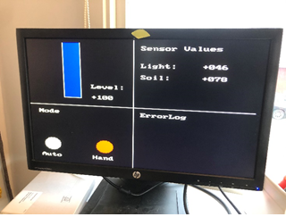  
**Figure 4 Hand mode**

While in Hand mode pressing PB_1 will open the solenoid. (See figure)

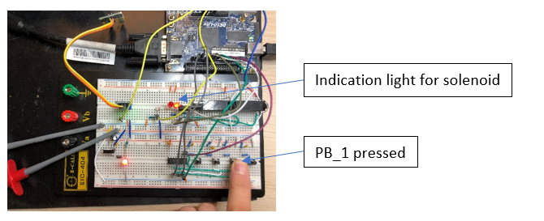  
**Figure 5 Manual mode**

### 3.2 Automatic mode

The system is in auto mode the soil is dry, but the light is above the threshold of 25%. No water flow (see figures).

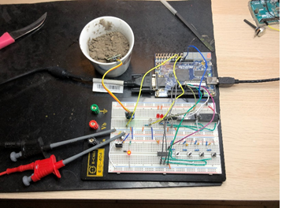  
**Figure 6 Dry soil**

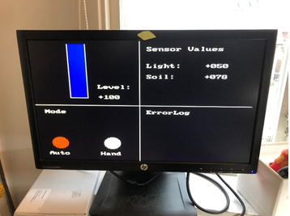  
**Figure 7 Light above 25 %**

The system open the valve when the light level lays under the threshold of 25 (see figures).

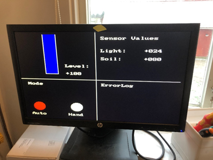  
**Figure 8 Auto condition**

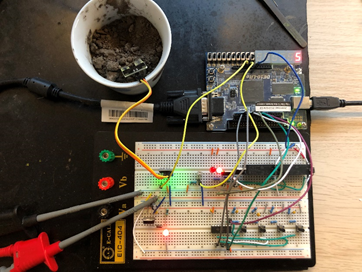  
**Figure 9 Auto condition**

In the next case, the soil needs to be wet. Therefore, the sensor head is put in a bucked of moist soil. Now the valve shut. The light is still under the threshold. (see figure)

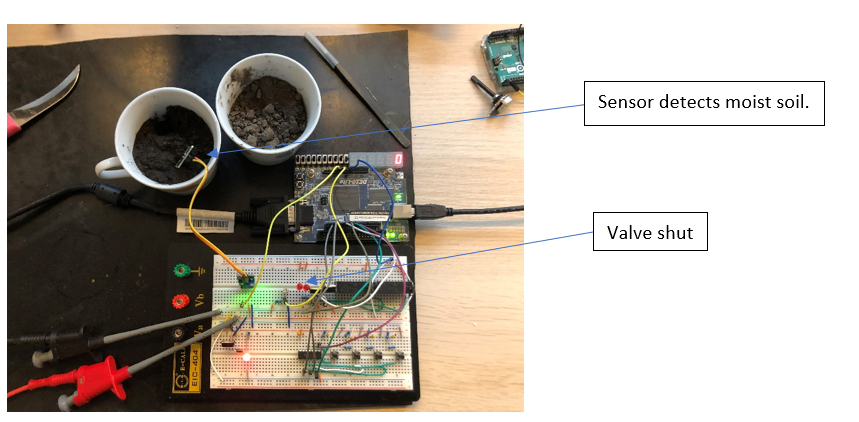  
**Figure 10 Auto condition**

### 3.3 Error handler

The threshold to fire the error is for demonstration purpose defined to 95. The value can be changed to the desired level. When the water flows through the Hall effect sensor the amount of water gets subtracted from the tank. When the tank reaches a level of 95 the valve shuts and the system changes to manual mode. This is to prevent that the system starts directly to water when above the threshold. Following Figure shows the HMI in the error state.

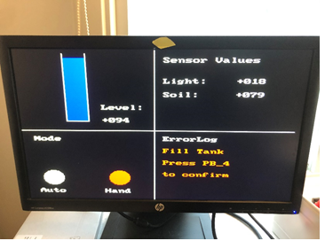  
**Figure 11 Error**

### 3.4 Reset

When the system is in an error state it is possible to confirm the error with the reset key. Pressing the key will also reset the tank level to 100%. The system remains in hand mode (see figure).

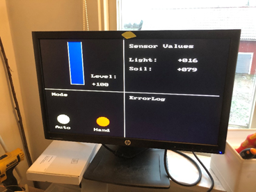  
**Figure 12 Reset**
